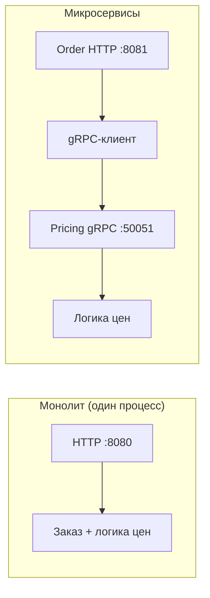

# Обработка заказов: от монолита к микросервисам (gRPC)

Этот репозиторий сопровождает практическое задание по рефакторингу небольшого Go-приложения из **монолитного HTTP-сервиса** в **два взаимодействующих сервиса**, где расчёт цен вынесен за **gRPC** API. Предметная область намеренно небольшая, чтобы можно было сосредоточиться на структуре, контрактах и тестировании.

---

## 1. Обзор проекта

Система моделирует **обработку заказов** с одной задачей по ценообразованию: применение **правил скидок** к сумме заказа.

**Сущности**

- **Order** — поля: `id` (string), `user_id` (string), `amount` (float64).

**Операции**

- Создать заказ по `user_id` и `amount`.
- Вычислить **итоговую цену** с учётом скидок.

**Правила скидок** (применяется наиболее выгодный уровень)

- Если `amount > 500` → скидка **20%**.
- Иначе если `amount > 100` → скидка **10%**.
- Иначе → **без** скидки.

В репозитории есть два запускаемых варианта:

1. **`monolith/`** — HTTP API и логика ценообразования в одном процессе.
2. **`services/order/`** + **`services/pricing/`** — HTTP-сервис на границе вызывает микросервис ценообразования по gRPC.

Общие protobuf-определения лежат в **`proto/`**, сгенерированный Go-код — в **`pkg/pricingpb/`**.

---

## 2. Цели обучения

После работы с этим проектом вы сможете:

- Сравнивать **монолитную** и **микросервисную** упаковку в Go.
- Описывать контракт **gRPC** через Protocol Buffers и генерировать Go-заглушки.
- Держать **доменные правила** (ценообразование) в отдельном сервисе с узким API.
- Писать **интеграционные тесты**, фиксирующие поведение в разных реализациях.
- Запускать сервисы **без Docker**, используя только тулчейн Go и при необходимости `make`.

---

## 3. Архитектура системы



- **Монолит**: один HTTP-сервер применяет правила скидок напрямую.
- **Микросервисы**: сервис **order** отвечает за HTTP и идентификатор заказа; сервис **pricing** содержит всю математику скидок и отдаёт `CalculatePrice` по gRPC.

---

## 4. Описание монолита

Путь: **`monolith/`**

| Файл | Назначение |
|------|------------|
| `main.go` | Запускает `net/http` на `PORT` (по умолчанию `:8080`). |
| `service/order_service.go` | Правила скидок, итоговая цена, создание заказа. |
| `handler/http_handler.go` | `POST /order` JSON на вход и выход. |

**HTTP API**

- **POST** `/order`
- **Тело запроса** (JSON): `{ "user_id": "<string>", "amount": <number> }`
- **Тело ответа** (JSON): `{ "order_id": "<string>", "final_price": <number> }`

**Юнит-тесты** лежат рядом с кодом в `monolith/service` и `monolith/handler`.

---

## 5. Описание микросервисов

### 5.1 Сервис order

Путь: **`services/order/`**

- Принимает **тот же HTTP-контракт**, что и монолит (`POST /order`).
- Использует **`services/order/client`** для вызова сервиса ценообразования по gRPC.
- Генерирует `order_id` на границе HTTP (в этом задании сервис order владеет идентификатором заказа).

Адрес HTTP по умолчанию: переменная **`PORT`** или **`:8081`**, чтобы не конфликтовать с монолитом по умолчанию.

### 5.2 Сервис pricing

Путь: **`services/pricing/`**

- Содержит **всю бизнес-логику, связанную со скидками**, в `service/pricing_service.go`.
- Отдаёт gRPC **`PricingService.CalculatePrice`** (см. protobuf).
- Регистрирует **gRPC reflection** для инструментов вроде `grpcurl` (опционально).

Адрес gRPC по умолчанию: **`PRICING_GRPC_ADDR`** или **`:50051`**.

---

## 6. gRPC-взаимодействие

**Файл proto:** `proto/pricing.proto`

**Сервис:** `PricingService`  
**RPC:** `CalculatePrice`

| Сообщение | Поля |
|-----------|------|
| `CalculatePriceRequest` | `amount` (`double`) |
| `CalculatePriceResponse` | `final_price` (`double`) |

Сервис order использует **контексты запросов** с таймаутами для gRPC-вызовов и возвращает **502 Bad Gateway**, если pricing недоступен.

**Перегенерация Go-кода** (нужны `protoc` и плагины для Go — см. Makefile):

```bash
make proto
```

Сгенерированные файлы закоммичены в **`pkg/pricingpb/`**, чтобы `go build` и `go test` работали в чистом клоне без шага генерации кода.

---

## 7. Задание

Выполните упражнение в таком порядке:

1. **Запустите монолит** и вручную проверьте `POST /order` с примерами JSON (см. раздел 9).
2. **Запустите полный набор тестов** и убедитесь, что всё зелёное:

   ```bash
   go test ./...
   ```

3. **Разберите разделение**: сравните `monolith/service` с `services/pricing/service` и HTTP-обработчики order. Поймите, что перенесло, а что осталось на границе.
4. **Если вам дан только монолит** (не полный репозиторий), **вынесите** pricing в `services/pricing`, опишите его через **`proto/pricing.proto`** и реализуйте **клиент** сервиса order в `services/order/client`.
5. **Реализуйте gRPC** сквозь всю цепочку: регистрация сервера в pricing, dial клиента в order и вызовы с учётом контекста.
6. **Итерируйте, пока все тесты не пройдут**, особенно интеграционные в **`tests/`**, которые проверяют одинаковое числовое значение `final_price` для общих сценариев.

Критерий успеха: интеграционные кейсы для сумм **50**, **150** и **600** дают **одинаковый** `final_price` и в HTTP API монолита, и в HTTP API микросервисов.

---

## 8. Как запустить

Требования: **Go 1.22+** (в модуле указано `go 1.22`). Опционально: **`protoc`** только если перегенерируете protobuf.

### Монолит

```bash
go run ./monolith
# слушает :8080, если не задан PORT
```

### Сервис pricing (gRPC)

```bash
go run ./services/pricing
# слушает :50051, если не задан PRICING_GRPC_ADDR (например :50051)
```

### Сервис order (HTTP → gRPC)

В отдельном терминале (pricing уже запущен):

```bash
PRICING_GRPC_ADDR=localhost:50051 PORT=8081 go run ./services/order
```

### Тесты

```bash
go test ./...
```

### Команды Makefile

```bash
make test
make build    # бинарники в ./bin
make run-pricing
make run-order
make run-monolith
```

---

## 9. Примеры ожидаемого вывода

Допустимо, что JSON будет красиво отформатирован по-разному; важны **коды статуса** и **`final_price`**.

**Монолит** (`http://localhost:8080`):

```bash
curl -s -X POST http://localhost:8080/order \
  -H 'Content-Type: application/json' \
  -d '{"user_id":"alice","amount":150}'
```

Пример ответа:

```json
{"order_id":"<generated>","final_price":135}
```

**Микросервисы** (`http://localhost:8081`, pricing на `localhost:50051`):

```bash
curl -s -X POST http://localhost:8081/order \
  -H 'Content-Type: application/json' \
  -d '{"user_id":"alice","amount":600}'
```

Пример ответа:

```json
{"order_id":"<generated>","final_price":480}
```

**Эталонные итоговые цены** (интеграционный набор):

| `amount` | Правило | `final_price` |
|----------|---------|----------------|
| 50 | без скидки | 50 |
| 150 | скидка 10% | 135 |
| 600 | скидка 20% | 480 |

---

## Структура репозитория

```
.
├── Makefile
├── README.md
├── go.mod
├── proto/
│   └── pricing.proto
├── pkg/
│   └── pricingpb/          # сгенерированный protobuf + gRPC код
├── monolith/
│   ├── main.go
│   ├── handler/
│   └── service/
├── services/
│   ├── order/
│   │   ├── main.go
│   │   ├── client/
│   │   └── handler/
│   └── pricing/
│       ├── main.go
│       ├── grpcserver/
│       └── service/
└── tests/
    ├── cases.go
    ├── monolith_test.go
    └── microservices_test.go
```

---

## Лицензия

Учебное использование. Можно адаптировать под материалы вашего курса.
